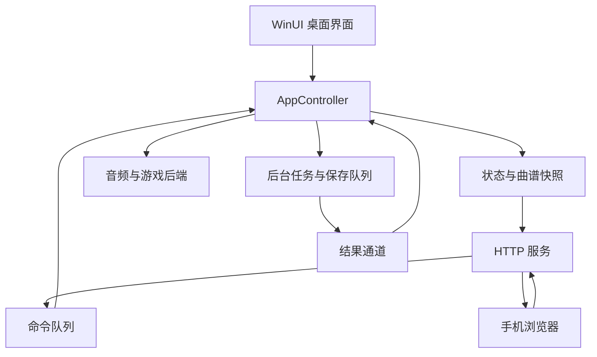

# Rust 应用架构

本文对应当前 Rust / WinUI 3 实现，版本以 [Cargo.toml](../Cargo.toml) 为准。使用与构建步骤见 [README](../README.md)，修改约束见 [AGENTS.md](../AGENTS.md)。

## 分层与状态所有权

桌面界面和手机遥控共享一个 `AppController`。界面保存搜索词、弹窗状态等展示数据；工程、后台任务、保存及播放流程由控制器统一管理。网络线程与工作线程不直接操作控件或替换应用状态。



`src/main.rs` 提供桌面和命令行入口；命令行转换、校验等操作使用共享业务模块，诊断使用控制器与可替换后端。`src/lib.rs` 通过 `#[path]` 映射物理目录，保留 `crate::controller`、`crate::midi` 等逻辑模块路径。不要根据逻辑模块名在旧位置新建重复文件。

| 位置 | 职责 |
| --- | --- |
| `src/core/controller.rs`、`controller/` | 唯一业务控制器、状态、文档、导出、播放、遥控及生命周期测试 |
| `src/core/jobs.rs` | 任务取消、结果通道、串行保存队列 |
| `src/core/paths.rs`、`preferences.rs` | 应用路径、数据路径与偏好 |
| `src/content/` | 曲库扫描、文件通知和歌曲对应工程 |
| `src/score/` | MIDI、推荐、提取、编辑、工程与导出 |
| `src/media/` | 试听合成、音频和游戏后端、播放时钟 |
| `src/shell/gui.rs`、`gui/` | 桌面组件、事件、布局、控件、绘图、弹窗及 Windows 接口 |
| `src/shell/theme.rs` | 桌面主题 Palette |
| `src/shell/remote.rs`、`remote/` | HTTP 服务、认证、命令适配及传输测试 |
| `assets/remote.html`、`remote.css`、`remote.js` | 手机浏览器界面、状态同步与动画 |
| `src/launcher.rs` | 便携版外层启动器 |

## 后台任务、保存与关闭

`AppController::poll` 消费后台结果并产生视图事件。加载、转换、导出与曲库扫描使用后台任务；接收结果时核对任务身份、工程身份、编辑版本和取消状态，避免旧结果覆盖后续操作。

`JobRunner` 的取消是协作式取消，取消请求不等于线程已经退出。控制器通过后续轮询推进换曲和关闭流程，不在主线程用阻塞等待代替生命周期管理。

`SaveQueue` 按顺序处理显式保存，仅合并允许合并的相邻自动保存。保存使用独立快照，后续编辑不会改变已入队内容。关闭或换曲先处理需要保存的文档；失败时保留现有工程与恢复信息。工程写入及导出发布使用暂存、校验和安全替换流程。

## MIDI、推荐与曲谱处理

1. `score/midi.rs` 读取原始多声部及节奏时间，不按口琴音域删除原始音符。`midi_text.rs` 优先使用 UTF-8，在 Windows 下兼容 GB18030（含 GBK/GB2312），无法解码时使用占位名称。
2. `score/recommendation.rs` 计算 0–100 推荐指数；`service::load_ranked_midi` 将排序结果与声部数据交给控制器。评分考虑单音程度、连续性、覆盖、音域可达性、音高变化等因素，并限制音轨名称的影响。指数是启发式偏好，不是正确率。
3. 桌面导入页按推荐顺序展示音符数、完整音域、时长与推荐指数，默认选择第一项，允许手动改选。
4. `score/melody.rs` 根据选定声部和选项提取旋律，执行速度、移调、口琴音域及乐句八度处理。自动八度适配不保证保留所有音符，界面需要区分调整与丢弃统计。
5. `score/editor.rs` 提供命中、缩放、滚动、选择、拖动和撤销重做等无界面编辑模型；音符提交复用 `notes.rs` 的规范化与校验。
6. `score/project.rs` 读写兼容的 `.hstudio` 工程；`service.rs` 组织转换和完整导出，并在发布前校验临时产物。

原始音符、可编辑曲谱和播放计划是不同层次的数据。重新导出已编辑工程不再次提取旋律，也不叠加历史八度调整。

音符拖动保存开始时的快照，移动阶段只是预览，松手才提交历史。删除、微调、新增、撤销或重做会先取消未完成的预览，再针对已提交的曲谱执行操作；后续移动、松手和捕获丢失事件不能恢复旧音符或重复写入历史。松手时还检查目标下标是否有效。模型回归覆盖“按住音符时删除或撤销”的事件顺序；这不替代实际 Windows 指针捕获与键盘组合验收。

## 播放时间与后端

`score/schedule.rs`、`rests.rs` 从曲谱派生按键计划与空白压缩时间映射。按键提前量、松键间隔和压缩空白不回写原工程时间；心动片段等标记仍保存原谱时间，播放时使用对应映射。

编辑后导出仍遵守工程中的 `trim_silence`：启用时从派生播放音符中减去首音起点，保留原始工程时间，并重新建立双向时间映射；未设置或关闭时保留开头空白。首次试听需要后台重新生成失效的导出，生成耗时与播放中的静音等待应分别诊断。试听失效只隐藏编辑器游标，不重置用户视图或取消正在进行的平移；实际播放时仍以传输位置为准。

`media/preview.rs` 合成试听 WAV；`media/playback.rs` 提供 Windows MCI 音频后端及独立 AutoHotkey 演奏后端。控制器通过后端接口发出播放、暂停、停止和定位指令，`media/transport.rs` 的播放时钟负责设备采样间的位置估计。

测试和诊断可以注入 `FakeAudio`、`SilentGame`，不需要向真实游戏发送按键。这些测试不能证明实际音频延迟或游戏兼容性。

`ScriptPlayer` 使用原子替换写入 `command.json`，命令包含 `id`、`action` 和可选 `start_ms`。Rust 用专用结构体固定输出顺序，兼容已导出、要求 `id` 在前的旧脚本；新 AHK 解析器按字段识别，不依赖顺序，拒绝重复字段、未知字段和非法值。编号为 1–9007199254740991，起点为 0–86400000 整数毫秒；整条命令校验通过后才消耗编号，旧编号不会重复执行。读取命令时允许共享删除，避免阻挡 Rust 原子替换。

AHK 发布包含 `request_id` 的状态，Rust 只接受当前编号的有效状态。`exit.stop` 退出信号优先于命令文件；F6/F8 是独立热键路径。Windows 下的 `src/media/playback/protocol_tests.rs` 让真实 Rust 命令写入、AHK 解析与状态发布、Rust 状态读取联动，仅替换会操作游戏的开始/停止处理函数，不注册热键或发送按键；这与假后端测试、实际游戏验收是不同证据。

## 桌面界面、主题与曲库

`gui.rs` 保留桌面组件和入口，`gui/events.rs` 处理消息，其他私有子模块负责布局、导入页、编辑页、对话框、资源、绘图和原生接口。文本、按钮、输入和页签使用 WinUI 原生控件；设置与手机连接通过 ContentDialog 管理模态交互，曲谱等画布由 Direct2D 绘制。

`theme.rs` 的 `Palette` 为桌面主题颜色来源，`gui/resources.rs` 等模块将颜色应用到原生控件和绘图。主题变化需要同时更新资源与画布；资源键存在或测试通过不代表实际窗口显示正确。

`content/library.rs` 扫描曲库并提供文件通知，刷新经过后台任务与去抖，不逐帧遍历目录。`song_projects.rs` 管理歌曲对应工程，偏好保存曲库位置与转换选项。

`gui/library_popup.rs` 负责曲库搜索、匹配数量、当前曲目标记和管理操作。列表按完整文件路径选择歌曲，避免筛选后的下标指向错误曲目；刷新保留搜索词，选曲继续走已有文档打开流程。当前曲目按路径匹配，同名但不同目录的文件不是同一项。

## 手机遥控与进度动画

`remote.rs` 提供页面、状态、曲谱与命令端点。Windows 系统随机源生成会话令牌；服务检查认证、Host 和 Origin，并限制连接数、请求大小及命令队列。手机通过二维码取得凭据，网络线程只读取已发布快照或提交命令。

监听器以非阻塞方式接受连接，已接受的连接在同步读写前切回阻塞模式并设置超时，避免分段到达的 HTTP 请求被提前当成失败。相关传输回归在 `shell/remote/http_tests.rs`。

控制器定时发布状态；曲谱快照按工程身份、编辑版本、导出版本及空白压缩选项缓存，避免每次轮询重建大谱。手机分别请求 `/api/state` 和 `/api/score`，通过曲谱标识及请求代次避免旧请求覆盖新曲目。

`remote.js` 正常约每 500 ms 轮询一次状态，播放画面由 `requestAnimationFrame` 和本地时钟连续驱动。正常播放的小误差平滑校准，校正速度限制为正常速度的 25%；大幅定位与状态切换立即应用。两次响应之间外推最多 5 秒，连接失败时冻结，页面隐藏时取消请求与动画。手机主动拖动立即定位；短于 1 秒的电脑端外部定位可能被平滑校准。

Canvas 仅绘制当前时间窗口内的音符，用音符结束时间的前缀最大值定位起点，保留跨越窗口的长音。绘图像素比上限为 2，相同主题色不重复写入 CSS。这里的优化降低抖动与绘图成本，不构成真实手机帧率保证。

正式遥控监听局域网；控制层集成测试使用 `start_remote_local`，只监听 `127.0.0.1`，保留相同的认证与业务路径。

## 便携目录与路径

```text
HarmonicaStudio/
├─ HarmonicaStudio.exe       外层启动器
├─ 使用说明.txt
├─ samples/                 默认曲库
├─ data/                    默认个人数据
└─ program/
   ├─ HarmonicaStudio.exe   内部主程序
   ├─ portable-layout.txt  布局标记
   ├─ assets/
   ├─ third_party/
   └─ 运行 DLL 与语言资源
```

`src/launcher.rs` 由正式脚本独立编译，不链接 WinUI。它启动内部主程序，传递调用者参数、工作目录、输出和退出码，共用主程序图标与版本资源。

`paths.rs` 区分三类位置：

| 路径 | 正式便携版 | 调试版 |
| --- | --- | --- |
| 资源根目录 | 内部 EXE 所在的 `program/` | 仓库根目录 |
| 应用根目录 | `program/` 与有效布局标记共同识别的外层目录 | 仓库根目录 |
| 默认数据目录 | 应用根目录下的 `data/` | 仓库下的 `data/` |

`HARMONICA_STUDIO_HOME` 可覆盖个人数据目录；默认曲库为应用根目录下的 `samples/`，设置支持外部绝对路径或相对应用根目录的路径。便携版必须整体移动，不依赖启动时的工作目录寻找默认数据。

## 构建、安装与验证边界

Cargo 默认启用 `desktop`，桌面二进制明确要求该功能。`scripts/test.ps1 -CoreOnly` 使用独立 `target/core-only`，不会以无桌面构建覆盖正常程序。`build.rs` 处理 WinUI 运行依赖以及图标和版本资源。

`scripts/build.ps1` 是唯一发布入口，串行完成测试、构建、资源与许可证收集、成品自测和安全安装。默认保持版本；`-Version` 显式更新版本，`-DistPath` 指定成品父目录，可用于暂存独立测试版。

安装前检查程序运行状态，不强制结束用户进程。安装使用回滚保护并保留已有曲库和数据；旧平铺目录迁移由 `scripts/portable-migration.ps1` 处理，无法确认的个人文件保留，需保留的旧文件备份到 `program/previous-layout/`。失败不将旧成品宣称为新版本，回滚失败时保留恢复材料并报告位置。

验证分为 Rust 合约测试、脚本安装夹具、成品自检、真实桌面视觉检查，以及手机浏览器与局域网实测。各类证据不能互相替代；尤其模拟时钟回放不是手机帧率测试，桌面截图也不能证明所有缩放正确。

默认曲库合约测试在临时目录使用 Rust 生成的 MIDI 夹具，覆盖多声部推荐及提取、编排、导出回读，不读取私人 `samples/`。固定歌曲和 SHA-256 的历史回归独立放在 `tests/local_corpus.rs`，标记为忽略，只有显式指定 `HARMONICA_TEST_CORPUS` 并运行 `--ignored` 才执行。资源缺失会报错；默认测试与打包不需要该数据集，忽略项不计为通过。

本地日志和截图保存于 `verification/`，不随 Git 提交。曲库、个人工程、凭据、构建缓存与便携产物也不属于源码交付；公开文档记录可复核结论及尚未验证的范围。诊断命令见 [diagnostics.md](diagnostics.md)。
